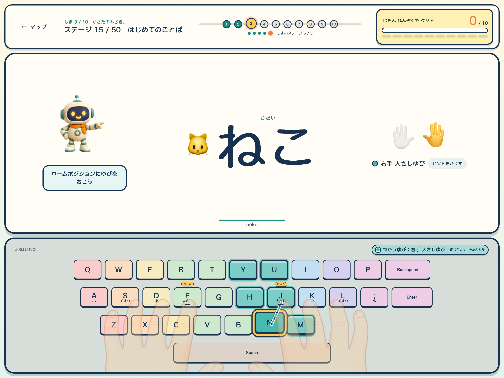
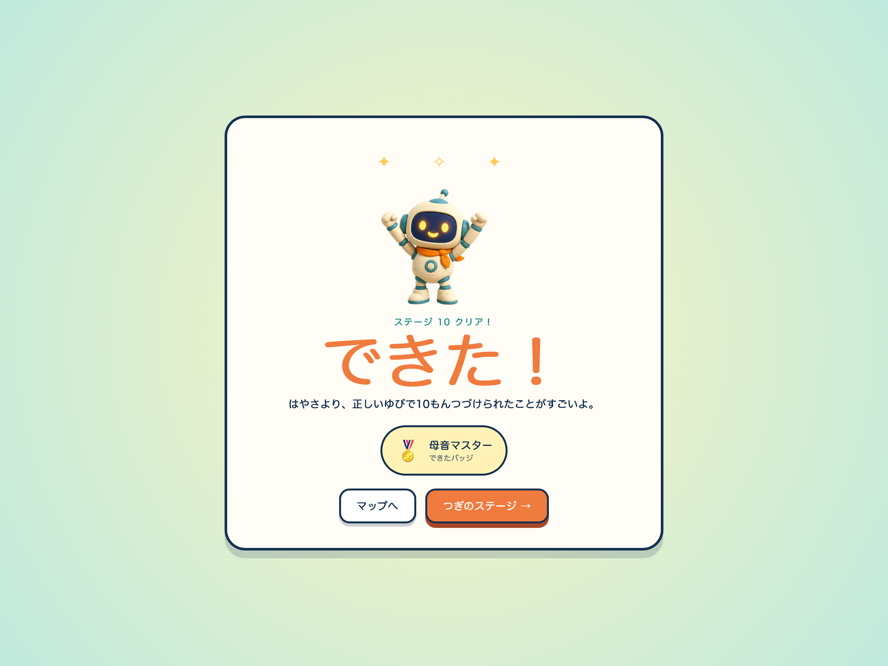

## キーボのタイピングじま

「キーボのタイピングじま」は、物理キーボードがはじめてのお子さんに向けたタイピング練習アプリです。小学生を中心に、親子で安心して使えるように作りました。

まずは速さよりも、「どのキーを、どの指で押すか」から。ホームポジション、ひらがな、ローマ字、日本語入力まで、50のステージをひとつずつ進みます。

間違えてもだいじょうぶ。あわてずにもう一度チャレンジしながら、小さな「できた！」を重ねていけます。

## 特徴

- ホームポジションから日本語入力まで、50ステージで少しずつステップアップ
- 画面を見れば、押すキーと使う指がすぐにわかる
- お使いのキーボードに合わせて、JIS配列とUS配列から選べる
- `shi`と`si`など、よく使われる複数のローマ字入力に対応
- 1ステージ10問。短い時間でも落ち着いて練習できる
- 間違えても減点やゲームオーバーはなし。その場でもう一度チャレンジ
- ステージクリアやバッジで、「できた！」を楽しく実感
- 家族それぞれのプロフィールと進み具合を端末内に保存
- アカウント登録は不要
- 広告、課金、ランキング、チャットはなし
- 一度インストールすれば、オフラインでも利用可能

## 必要なもの

- iPadまたはAppleシリコン搭載Mac
- Bluetooth、USB、Magic Keyboardなどで接続する物理キーボード

ご用意いただくのは、端末と物理キーボードだけです。アプリは見やすい横画面専用。キーボードがつながっていないときは、画面に接続方法をご案内します。

## 練習画面

画面には、お題の文字、使う指、押すキーをまとめて表示します。「次はどこを押すの？」と迷いにくく、手元と画面を見比べながら自分のペースで練習できます。

## 「できた！」を積み重ねる

大切にしているのは、速さだけではありません。正しい指で最後まで取り組めたことを、ロボットのキーボといっしょにしっかりお祝いします。

<h2 id="privacy-policy">プライバシーポリシー</h2>

制定日: 2026年7月18日

最終更新日: 2026年7月21日

「キーボのタイピングじま」は、お子さんにも安心して使っていただけるよう、プライバシーと個人情報の保護を大切にしています。

### 保存する情報

次の情報は、練習の続きを始められるように、お使いの端末内へ保存します。

- アプリ内で設定したプロフィール名
- キーボード配列などの設定
- ステージの進捗
- 練習結果と苦手なキーに関する記録

### 保存した情報の利用目的

- プロフィール名：家族ごとのプロフィールを見分けるため
- キーボード配列などの設定：使用するキーボードに合った案内を表示するため
- ステージの進捗：前回の続きから練習を始めるため
- 練習結果と苦手なキー：進み具合や復習情報を表示するため

これらの情報は、アプリの機能を提供するためだけに使用し、広告、分析、マーケティングには使用しません。

### データの収集と外部送信

保存した情報は、お使いの端末の中だけで管理します。開発者が収集したり、内容を見たり、外部へ送信したり、第三者へ提供したりすることはありません。

また、次のような機能やSDKも使用していません。

- ユーザーアカウント
- 広告
- 第三者分析
- トラッキング
- クラウド同期
- 外部サーバーへの入力内容の送信

アプリ内の練習画面は、公開中のWeb版をアプリのビルド時に取り込み、あらかじめ同梱しています。インストール後の練習、画面表示、進み具合の保存にインターネット接続は使いません。

### 第三者サービスと端末情報

本アプリには、第三者の分析、広告、トラッキング、アトリビューション、クラッシュレポートのためのSDKを組み込んでいません。

IDFAなどの広告識別子、端末識別子、位置情報などの利用者や端末に関する情報を、開発者または第三者のサーバーへ送信しません。

物理キーボードの接続状態は、接続案内を表示するために端末内で一時的に確認するだけで、開発者または第三者へ送信・共有しません。入力されたキーも端末内で処理し、外部へ送信しません。

### 端末機能

カメラ、写真、マイク、音声認識、位置情報は使用しません。

### 子どもの情報

本アプリは、お子さんの個人情報を外部へ送信しません。プロフィール名には本名を使わず、ニックネームを使うこともできます。

### データの削除

アプリ内の「プロフィール削除」または「データ初期化」から、端末内に保存した情報をいつでも削除できます。アプリを削除した場合も、アプリ内に保存された情報は端末から削除されます。

### プライバシーポリシーの変更

今後の機能追加などでデータの取り扱いが変わる場合は、このページを更新してお知らせします。

### お問い合わせ

気になることやご要望がありましたら、[お問い合わせページ](/contact/)からお気軽にご連絡ください。

<h2 id="support">サポート</h2>

うまく動かないときは、まずこちらをご確認ください。

- アプリを使うには、物理キーボードの接続が必要です。
- Bluetooth、USB、Magic Keyboardで接続できます。
- キーを押しても反応しないときは、キーボードをいったん接続し直し、アプリを再起動してみてください。
- 解決しない場合や、その他のご質問は[お問い合わせページ](/contact/)からお気軽にご連絡ください。
